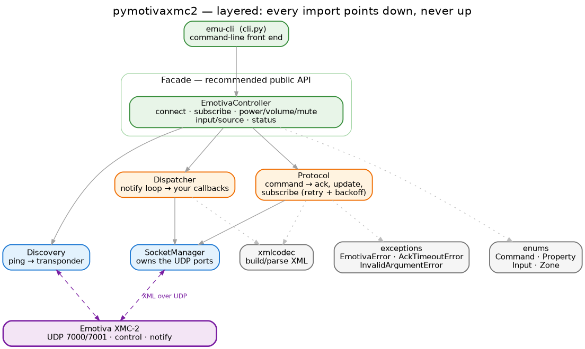
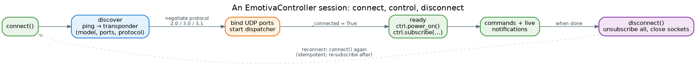

# Architecture overview

pymotivaxmc2 is a small library with a clear spine: a set of UDP sockets to the device at the bottom, a
high-level facade at the top, and a thin stack of protocol behaviour in between. The point of the layering
isn't ceremony — it's that the part that talks to the wire (`socket_mgr`) never has to know what a "volume
up" is (`controller`), and the part that knows what a command *is* (`protocol`) never has to know that an
`EmotivaController` object exists. You can drop down a level whenever you need to; most code never does.

## The layers, and the one rule

Read it top-down — each box imports only what's below it:

- **CLI — `cli.py`.** `emu-cli`, a thin argparse front end over the facade. It's the only module that sees
  a terminal; everything it does, you can do in code. See [Command-line interface](../guides/cli.md).
- **Facade — `controller.py`.** `EmotivaController`: the **recommended public API**. One object that
  discovers the device, negotiates the protocol version, binds the UDP ports, starts the notification
  dispatcher, and exposes typed helpers (`power_on`, `set_volume`, `select_input`, `subscribe`, `status`,
  …). This is where you should start.
- **Behaviour — `protocol.py`, `dispatcher.py`.** `Protocol` owns the request side: it builds command,
  update, and subscribe frames, sends them on the control port, and waits for the matching
  `<emotivaAck>` / `<emotivaSubscription>` — with a concurrency limit and exponential-backoff retries.
  `Dispatcher` owns the push side: a long-lived loop reading the notify port and fanning each property
  change out to your callbacks.
- **Transport — `socket_mgr.py`, `discovery.py`.** `SocketManager` binds and owns the small fixed set of
  UDP ports for one device and offers `send` / `recv`. `Discovery` performs the ping/transponder handshake
  that bootstraps a connection. Everything above ultimately routes through here.
- **Leaves — `enums.py`, `exceptions.py`, `xmlcodec.py`.** The `Command` / `Property` / `Input` / `Zone`
  enums, the error hierarchy, and the XML build/parse helpers. They import nothing from the rest of the
  package.

The single rule the whole thing rests on: **every import points down, never up.** It isn't a convention
you have to remember — `import-linter` checks it on every commit, so a planted backwards import (say,
`core` importing the `controller` facade, or `enums` importing anything) fails the build. The contracts
live in `pyproject.toml`; see [Contributing](../../CONTRIBUTING.md) for the health gates.

## Two ways in

The same device is reachable through two doors, and you pick by how much you want handed to you:

| Entry point | Layer | You get | Use when |
|---|---|---|---|
| `EmotivaController` | Facade | Auto-discovery, protocol negotiation, port binding, dispatcher startup, typed helpers | **Almost always** — this is the recommended path |
| `Protocol` + `SocketManager` + `Dispatcher` | Behaviour / transport | The raw frames and sockets; you wire them together yourself | You're embedding the protocol in a larger supervisor, or you need fine control over the connection |

Both speak the same protocol to the same device; the facade is just the protocol core with the wiring done
for you. Examples of each are in the [Quickstart](../guides/quickstart.md#dropping-to-the-protocol-core).

## The connection lifecycle

A session is always the same shape:

1. **`connect()`** runs [discovery](../guides/connection.md): a `<emotivaPing>` to the device on UDP 7000,
   a `<emotivaTransponder>` reply on 7001 carrying the model, the control/notify ports, and the device's
   protocol version.
2. **Protocol negotiation.** The controller uses the **lower** of the device's version and its own
   `protocol_max` (default `"3.1"`), falling back to `"2.0"` when the device doesn't report one.
3. **Ports bound, dispatcher started.** `SocketManager` binds the control and notify ports; the
   `Dispatcher` begins listening for notifications. Only now does the controller mark itself connected.
4. **`disconnect()`** unsubscribes from everything, stops the dispatcher, closes the sockets, and resets
   state. Both `connect()` and `disconnect()` are guarded by a lock and are safe to call more than once.

> **Reconnect.** `connect()` is idempotent — a second call while connected is a no-op. After a
> `disconnect()` (or a controller you've torn down), simply `connect()` again and **re-subscribe**:
> subscriptions don't survive a disconnect. See [Subscriptions](../guides/subscriptions.md#reconnecting).

## A note on the protocol

Emotiva devices speak a small XML protocol over **UDP**, across a handful of fixed-purpose ports rather
than one connection:

- **Discovery** is a ping on **7000** answered by a transponder on **7001**.
- **Commands, updates, and subscriptions** go out on the device's **control port** (7002 by default) and
  their acknowledgements come back on the same port.
- **Notifications** — the events you subscribe to — arrive asynchronously on the **notify port** (7003 by
  default).

Two wire dialects coexist, and the library handles both transparently. Protocol **2.0** names each
property as its own element (`<volume>-20.5</volume>`); protocol **3.0+** uses a generic `<property>`
element with `name` / `value` / `visible` attributes. Discovery tells the library which one the device
speaks, and `Protocol` / `Dispatcher` parse accordingly.

> **UDP is fire-and-forget.** There's no connection to drop, but there's also no delivery guarantee — which
> is why commands are retried with backoff and why the control port is read back for an explicit ack. See
> [Commands](../guides/commands.md#how-a-command-behaves).

## Where to go next

- **[Quickstart](../guides/quickstart.md)** — install, connect, send your first commands.
- **[Commands](../guides/commands.md)** — the full helper surface and the enums.
- **[Subscriptions](../guides/subscriptions.md)** — real-time events without polling.
- **[Connection & discovery](../guides/connection.md)** — the ping/transponder handshake and the port map.
- **[Command-line interface](../guides/cli.md)** — `emu-cli`.
