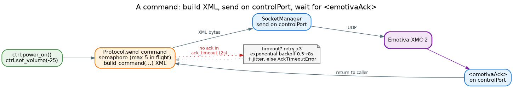

# Commands

Every command you send the processor is a method on `EmotivaController`. With the [facade](quickstart.md)
they're ready the moment `connect()` returns. This page is the full surface, grouped the way the device
thinks about it: power, volume, mute, inputs and sources, and reads.

## How a command behaves



Under each helper, `Protocol.send_command` builds an XML frame, sends it on the control port, and waits for
the device's `<emotivaAck>` on the same port. A few things follow from that:

- **They're coroutines** — always `await` them.
- **They're acknowledged, not just fired.** The library waits up to `ack_timeout` (default **2 s**) for the
  ack, and **retries up to three times** with exponential backoff (0.5 → 8 s, plus jitter) before raising
  **`AckTimeoutError`**. UDP has no delivery guarantee, so this is how a dropped packet recovers.
- **They're serialized.** Exactly one control-port transaction (command, subscribe, or status read) is in
  flight at a time; concurrent calls queue in order. Emotiva processors have limited processing power —
  concurrent control traffic can make the device unresponsive — and all control replies arrive on one
  UDP socket, so serialization also guarantees a reply is always matched to the transaction that is
  actually waiting for it. Stale frames (late replies from an earlier timed-out attempt) are drained
  before each send and discarded if they arrive mid-wait — they never fail a fresh transaction.
- **State helpers take a keyword-only `zone`.** `Zone.MAIN` (default) or `Zone.ZONE2`.

```python
await ctrl.power_on()                       # waits for the ack, retries on loss
await ctrl.set_volume(-30.0, zone=Zone.ZONE2)
```

> **Tuning the ack wait.** Construct the controller with `EmotivaController(host, ack_timeout=1.0)` to
> shorten or lengthen the per-attempt wait. Discovery has its own `timeout` (default 5 s).

### Retries, `ack="no"`, and pacing

Every command helper (and `status()`) accepts per-call knobs, and the controller takes two
constructor-level ones:

```python
ctrl = EmotivaController(host,
                         max_retries=3,          # default total attempts per transaction
                         min_send_interval=0.1)  # >= 100 ms between control-port sends

await ctrl.power_on(retries=0)            # exactly ONE send — no re-sends on a slow ack
await ctrl.set_volume(-30.0, ack=False)   # fire-and-forget: ack="no", nothing awaited
status = await ctrl.status(Property.POWER, retries=0)
```

- **`retries=`** counts *re-sends after the first attempt* — `retries=0` is exactly one packet.
  Use it when the device may be mid-transition (power-on, HDMI/ARC handshake): a retry into a busy
  device is more load at the worst moment. `None` (default) uses the constructor's `max_retries`.
- **`ack=False`** builds the command with `ack="no"` (the protocol makes the ack optional), sends
  once, awaits nothing, and returns `None`. There is no delivery confirmation — pair it with a
  subscribed notification if you need to observe the effect.
- **`min_send_interval`** enforces a minimum gap between *all* control-port sends. Emotiva
  processors have limited processing power; one knob paces every transaction.
- **Status reads retry only what's missing.** A partial Update response re-requests just the
  absent properties, never the whole batch.

---

## Power — `tv.power_*`

| Method | Effect |
|---|---|
| `power_on(*, zone=Zone.MAIN)` | Power the zone on |
| `power_off(*, zone=Zone.MAIN)` | Power the zone off |
| `power_toggle(*, zone=Zone.MAIN)` | Toggle the zone (main zone uses the `Standby` command) |

```python
await ctrl.power_on()
await ctrl.power_off(zone=Zone.ZONE2)
```

## Volume — `ctrl.set_volume` / `ctrl.vol_*`

Volume is in **dB** (the device's native scale — negative values are normal, e.g. `-25.0`).

| Method | Effect |
|---|---|
| `set_volume(db, *, zone=Zone.MAIN)` | Set an absolute level in dB |
| `vol_up(step=1.0, *, zone=Zone.MAIN)` | Relative increase (delegates to `set_volume_relative`) |
| `vol_down(step=1.0, *, zone=Zone.MAIN)` | Relative decrease |
| `set_volume_relative(delta, *, zone=Zone.MAIN)` | Change by a signed delta in dB |

```python
await ctrl.set_volume(-25.0)
await ctrl.vol_up(2.0)              # +2 dB
await ctrl.vol_down()              # -1 dB (default step)
```

## Mute — `ctrl.mute_*`

| Method | Effect |
|---|---|
| `mute_toggle(*, zone=Zone.MAIN)` | Toggle mute |
| `mute(*, zone=Zone.MAIN)` | Alias of `mute_toggle` |
| `mute_on(*, zone=Zone.MAIN)` | Force mute on |
| `mute_off(*, zone=Zone.MAIN)` | Force mute off |

```python
await ctrl.mute_on()
await ctrl.mute_toggle(zone=Zone.ZONE2)
```

## Inputs and sources — `ctrl.select_input` / `ctrl.select_source`

There are **two** ways to change what you're watching, and they're not the same:

- **`select_input(input)` — a raw physical connector.** Switches directly to a hardware input like
  `hdmi1`, `coax2`, or `optical3`. Accepts an `Input` enum member or its string name.
- **`select_source(source)` — a logical "Input N" button.** Mirrors the front-panel / remote **Input 1–8**
  buttons, loading the *full configured A/V source profile* (with its user-assigned name), not just a
  connector. Accepts an integer `1`–`8`, or the string `"tuner"`.

```python
from pymotivaxmc2 import Input

await ctrl.select_input(Input.HDMI1)     # by enum
await ctrl.select_input("coax2")          # or by name

await ctrl.select_source(3)               # the "Input 3" profile
await ctrl.select_source("tuner")
```

`select_input` raises **`InvalidArgumentError`** for an unknown input; `select_source` raises it for
anything that isn't `1`–`8` or `"tuner"` (and explicitly rejects `bool`). Both are **main-zone only**.

## Reads — `ctrl.status` / `ctrl.get_input_names`

### `status(*props, timeout=2.0) -> dict[Property, str]`

A one-shot snapshot. Pass one or more `Property` members; you get back a `{Property: value}` dict. Raises
`InvalidArgumentError` if you pass none.

```python
from pymotivaxmc2 import Property

snap = await ctrl.status(Property.POWER, Property.VOLUME, Property.SOURCE)
print(snap[Property.VOLUME])     # e.g. "-25.0"
```

> Under the hood this sends an `<emotivaUpdate>` and collects the matching notification frames, with the
> same retry/backoff as commands. Properties the device doesn't return are simply absent from the dict.

### `get_input_names(timeout=2.0) -> dict[int, dict]`

Reads the **user-assigned names** of the Input 1–8 buttons and whether each is visible, by querying the
`input_1`..`input_8` properties:

```python
names = await ctrl.get_input_names()
# {1: {"name": "ZAPPITI", "visible": True},
#  2: {"name": "Apple TV", "visible": True},
#  3: {"name": "HDMI 3",   "visible": False}, ...}
```

Buttons the device doesn't report are omitted; hidden buttons report `visible=False` so you can filter
them. This pairs naturally with `select_source(n)` — read the names to build a menu, then select by number.

---

## The enums

The typed surface lives in four `StrEnum`s, all importable from the package root:

| Enum | What it is | Examples |
|---|---|---|
| `Command` | Every raw protocol command (mostly used internally by the helpers) | `Command.POWER_ON`, `Command.SET_VOLUME`, `Command.SOURCE_1` |
| `Property` | Every subscribable / queryable property | `Property.VOLUME`, `Property.POWER`, `Property.SOURCE`, `Property.ZONE2_VOLUME` |
| `Input` | Physical input connectors for `select_input` | `Input.HDMI1`, `Input.COAX2`, `Input.OPTICAL3`, `Input.TUNER` |
| `Zone` | The addressable zones | `Zone.MAIN`, `Zone.ZONE2` |

Because they're `StrEnum`s, a member *is* its wire string (`Input.HDMI1 == "hdmi1"`), so you can pass
either the member or the bare string wherever a helper accepts one. `Property.name.lower()` gives you a
readable label for display.

```python
from pymotivaxmc2 import Command, Property, Input, Zone
```

## Errors

| Exception | Raised when |
|---|---|
| `AckTimeoutError` | No `<emotivaAck>` arrived after all retries (also raised on an unexpected response tag) |
| `InvalidArgumentError` | A helper got a value it can't map — unknown input, out-of-range source, empty `status()` |
| `EmotivaError` | Base class for all of the above; also raised if you call a command before `connect()` |

All three are importable from the package root (`EmotivaError`, `AckTimeoutError`, `InvalidArgumentError`).

## Where to go next

- **[Subscriptions](subscriptions.md)** — turn `Property` reads into a live event stream.
- **[Connection & discovery](connection.md)** — what `connect()` set up before any of this works.
- **[Command-line interface](cli.md)** — the same surface from the shell.
