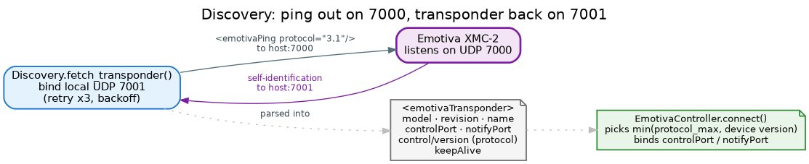

# Connection & discovery

There's no pairing and no cloud account — an Emotiva processor announces itself on the LAN, and `connect()`
finds it with a single UDP exchange, reads its capabilities, and binds the ports it needs. This page is
what happens behind that one call.

## The handshake



`connect()` starts with **discovery**. The library binds local UDP port **7001**, sends a
`<emotivaPing protocol="3.1"/>` to the device on UDP **7000**, and waits for the device's
`<emotivaTransponder>` self-identification packet to come back on 7001. That reply carries everything the
library needs:

| Field | Used for |
|---|---|
| `model`, `revision`, `name` | Identification (surfaced in logs) |
| `control/version` | The device's **protocol version** |
| `controlPort` | Where commands, updates, and subscriptions are sent (and acked) |
| `notifyPort` | Where asynchronous notifications arrive |
| `keepAlive` | The device's keep-alive interval |

Discovery is resilient: it makes **up to three attempts** with exponential backoff before raising
`DiscoveryError`, so a single dropped UDP packet doesn't fail the connection.

## Protocol negotiation

Emotiva firmware speaks one of protocol **2.0**, **3.0**, or **3.1**, and the two wire dialects differ (see
the [Architecture overview](../architecture/overview.md#a-note-on-the-protocol)). The controller picks the
**lower** of the device's reported version and its own ceiling:

```python
ctrl = EmotivaController("192.168.1.50", protocol_max="3.1")   # default ceiling
```

So a 3.1 device with the default ceiling negotiates 3.1; the same device with `protocol_max="2.0"` is held
to 2.0. If the transponder doesn't report a version at all, the library defaults to `"2.0"`. You rarely
need to touch this — the default ceiling is the newest the library supports.

## The port map

A connected controller owns a small, fixed set of UDP ports. The discovery ports are well-known; the
control and notify ports come from the transponder (with the defaults below):

| Port | Default | Direction | Purpose |
|---|---|---|---|
| 7000 | fixed | → device | Discovery ping |
| 7001 | fixed | ← device | Transponder reply |
| control | 7002 | ↔ device | Commands, updates, subscriptions, and their acks |
| notify | 7003 | ← device | Asynchronous property notifications |

`SocketManager` binds the control and notify ports and owns them for the life of the connection; partial
binds are cleaned up on failure, and `disconnect()` closes them all.

## Constructor options

```python
EmotivaController(
    host,                 # IP or hostname of the processor (required)
    *,
    timeout=5.0,          # discovery timeout, seconds (per attempt)
    protocol_max="3.1",   # highest protocol version to negotiate
    ack_timeout=2.0,      # per-attempt wait for a command's <emotivaAck>
)
```

| Option | Default | Affects |
|---|---|---|
| `timeout` | `5.0` | How long discovery waits for the transponder before retrying |
| `protocol_max` | `"3.1"` | The negotiation ceiling (see above) |
| `ack_timeout` | `2.0` | The per-attempt ack wait for [commands](commands.md#how-a-command-behaves) |

## Lifecycle and reconnect

```python
ctrl = EmotivaController("192.168.1.50")
await ctrl.connect()        # discover → negotiate → bind → start dispatcher
try:
    ...
finally:
    await ctrl.disconnect() # unsubscribe-all → stop dispatcher → close sockets
```

Both calls are guarded by a lock and are safe to call repeatedly: a second `connect()` while connected is a
no-op, and `disconnect()` always resets state even if a step fails. Calling any command **before**
`connect()` raises `EmotivaError("Controller is not connected; call connect() first")` rather than a vague
`AttributeError`. After a `disconnect()`, just `connect()` again and re-subscribe — see
[Subscriptions](subscriptions.md#reconnecting).

> **Network requirements.** Discovery is unicast UDP to a host you name, so it works across subnets as long
> as UDP 7000/7001 (and the control/notify ports) reach the device — but a firewall or a host that blocks
> inbound UDP on 7001 will make discovery time out. There is no multicast scan; you always supply the host.

## Where to go next

- **[Quickstart](quickstart.md)** — the end-to-end flow.
- **[Commands](commands.md)** — what to do once connected.
- **[Architecture overview](../architecture/overview.md)** — where discovery and the sockets sit in the
  stack.
