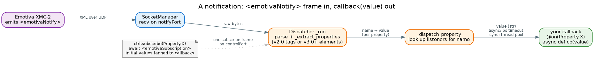

# Subscriptions

Polling the processor in a loop is wasteful and laggy. Instead, **subscribe** to the properties you care
about and the device pushes you an event whenever they change — volume, power, source, mode, and the rest
of the `Property` enum. They all work the same way.

## The pattern

Two calls: register a callback with `@ctrl.on(prop)`, then `subscribe(prop)`. The callback takes a single
argument — the property's new value, as a string:

```python
@ctrl.on(Property.VOLUME)
async def on_volume(value):
    print("Volume is now", value, "dB")

await ctrl.subscribe(Property.VOLUME)
# ... events arrive on the callback until you unsubscribe ...
await ctrl.unsubscribe(Property.VOLUME)
```

`subscribe()` and `unsubscribe()` accept a single `Property` or a sequence of them:

```python
await ctrl.subscribe([Property.VOLUME, Property.POWER, Property.SOURCE])
```

> **Register before you subscribe.** `subscribe()` returns the device's *current* value for each property
> **and** replays it through your registered callbacks (see [Initial values](#initial-values) below). If
> you register the callback afterwards, you'll miss that first value and only see subsequent changes.

Both `async def` and plain `def` callbacks work. Async callbacks run as tasks with a **5-second timeout**;
sync callbacks run in a thread-pool executor so a slow one can't block the notify loop. Either way, an
exception in your callback is logged and contained — it never breaks the subscription or the other
listeners.

## How an event reaches you



Subscribing leaves a long-lived listener registered against the property name. The `Dispatcher` runs a
background loop reading the **notify port**; each `<emotivaNotify>` frame is parsed, every property in it is
extracted, and each value is handed to the callbacks registered for that name. The parser understands both
wire dialects — protocol 2.0's element-per-property (`<volume>-20.5</volume>`) and protocol 3.0+'s
`<property name="volume" value="-20.5" .../>` — so your callback sees the same value regardless of the
device's firmware.

## Initial values

When you subscribe, the device's `<emotivaSubscription>` reply already carries the current value of every
property you subscribed to (Emotiva Remote Interface spec §2.1.3). The library does two things with it:

1. **Returns it.** `subscribe()` returns `{name: {"value": str, "visible": bool}}` for every property that
   subscribed successfully — handy for one-shot scripts that don't use callbacks.
2. **Replays it through your callbacks.** Each initial value is fanned out through the *same* dispatcher
   path as ongoing notifications, so a callback-based consumer reaches a consistent state immediately,
   without piping the return value through by hand.

```python
@ctrl.on(Property.VOLUME)
async def on_volume(value):
    print("volume:", value)          # fires once at subscribe time, then on every change

result = await ctrl.subscribe(Property.VOLUME)
print(result)                         # {"volume": {"value": "-25.0", "visible": True}}
```

The fan-out is purely additive — the return value is unchanged for callers that don't register callbacks,
and a misbehaving callback can't break the subscription.

## Reconnecting

Subscriptions live for the duration of a connection. `disconnect()` sends an unsubscribe-all to the device,
stops the dispatcher, and closes the sockets — so **after a reconnect you must re-subscribe.** Your
registered `@on` callbacks are attached to the dispatcher, which is rebuilt on `connect()`, so re-register
them too if you tore the controller down:

```python
await ctrl.disconnect()
# ... later ...
await ctrl.connect()

@ctrl.on(Property.VOLUME)             # re-register against the fresh dispatcher
async def on_volume(value):
    ...
await ctrl.subscribe(Property.VOLUME) # re-subscribe; current value replays again
```

> `connect()` itself is idempotent — calling it while already connected is a no-op, so a supervisor can
> call it freely. It's the *disconnect* that clears subscription state.

## What you can subscribe to

Any member of the `Property` enum the device supports — commonly `VOLUME`, `POWER`, `SOURCE`, `MUTE`-style
mode flags, `MODE`, `BASS`, `TREBLE`, `LOUDNESS`, and the `ZONE2_*` variants. See
[`enums.py`](../../pymotivaxmc2/enums.py) for the full list and the
[Emotiva Remote Interface Description](../Emotiva_Remote_Interface_Description.md) for what each one
reports.

## Where to go next

- **[Commands](commands.md)** — the one-shot `status()` read for when you don't need a live stream.
- **[Connection & discovery](connection.md)** — the notify port and how it's set up.
- **[Architecture overview](../architecture/overview.md)** — why the dispatcher loop outlives any single
  request.
